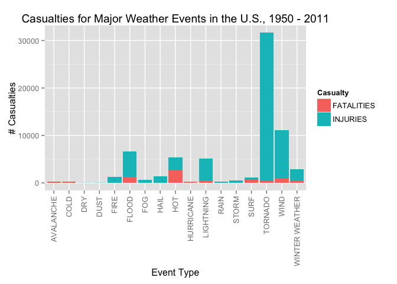
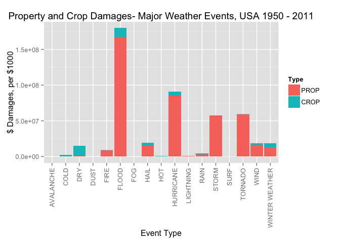

# Reproducible Research- Peer Assessment 2: A Study of Severe Weather Events and Their Negative Consequences

##<font color=blue>Synopsis</font>###
Synopsis: Immediately after the title, there should be a synopsis which describes and summarizes your analysis in at most 10 complete sentences.


##<font color=blue>Data Processing</font>
There should be a section titled Data Processing which describes (in words and code) how the data were loaded into R and processed for analysis. In particular, your analysis must start from the raw CSV file containing the data. You cannot do any preprocessing outside the document. If preprocessing is time-consuming you may consider using the cache = TRUE option for certain code chunks.

###Obtaining the Data###

The [dataset](https://d396qusza40orc.cloudfront.net/repdata%2Fdata%2FStormData.csv.bz2) is downloaded from the U.S. National Oceanic and Atmospheric Administration's (NOAA) storm database and read in to a dataframe called 'data'.  

```r
temp <- tempfile()
download.file("http://d396qusza40orc.cloudfront.net/repdata%2Fdata%2FStormData.csv.bz2", temp)
data <- read.csv(temp, stringsAsFactors=FALSE)
unlink(temp)
```

It takes several minutes to download and read in the file, it must be large.  We check to see how large exactly (902,297 rows with 37 columns) and look at the first few rows of the dataset.

```r
dim(data)
```

```
## [1] 902297     37
```


```r
head(data[,1:7])
```

```
##   STATE__           BGN_DATE BGN_TIME TIME_ZONE COUNTY COUNTYNAME STATE
## 1       1  4/18/1950 0:00:00     0130       CST     97     MOBILE    AL
## 2       1  4/18/1950 0:00:00     0145       CST      3    BALDWIN    AL
## 3       1  2/20/1951 0:00:00     1600       CST     57    FAYETTE    AL
## 4       1   6/8/1951 0:00:00     0900       CST     89    MADISON    AL
## 5       1 11/15/1951 0:00:00     1500       CST     43    CULLMAN    AL
## 6       1 11/15/1951 0:00:00     2000       CST     77 LAUDERDALE    AL
```

###Processing the Data###

From the 7 columns we just saw it's evident there will be unnecessary columns we can pare from a refined dataset.  But before we manipulate the data we need to load the necessary packages.  Note, if you haven't downloaded one or more of these packages you can by running the following code.

```r
install.packages('plyr')
install.packages('dplyr')
install.packages('lubridate')
install.packages('tidyr')
install.packages('ggplot2')
```


```r
library(plyr)
library(dplyr)
library(lubridate)
library(tidyr)
library(ggplot2)
```

Using the National Weather Service [Storm Data Documentation](https://d396qusza40orc.cloudfront.net/repdata%2Fpeer2_doc%2Fpd01016005curr.pdf) and the National Climatic Data Center Storm Events [FAQ](https://d396qusza40orc.cloudfront.net/repdata%2Fpeer2_doc%2FNCDC%20Storm%20Events-FAQ%20Page.pdf) as guides, the columns needed to analyze the data for the questions presented are selected to a refined dataframe called **'pData'**. The columns selected are <font color=orange>BGN_DATE</font> (date of event), <font color=orange>EVTYPE</font> (event type), <font color=orange>FATALITIES</font> (# of fatalities), <font color=orange>INJURIES</font> (# of injuries), <font color=orange>PROPDMG</font> (dollar amount of property damage), <font color=orange>PROPDMGEXP</font> (exponent for PROPDMG in thousands(K), millions(M), or billions(B)+), <font color=orange>CROPDMG</font> (dollar amount of property damage), and <font color=orange>CROPDMGEXP</font> (exponent for CROPDMG in thousands(K), millions(M), or billions(B)+). <br>

+as documented on page 12 section 2.7 of [Storm Data Documentation](https://d396qusza40orc.cloudfront.net/repdata%2Fpeer2_doc%2Fpd01016005curr.pdf)

```r
pData <- select(data, BGN_DATE, EVTYPE, FATALITIES, INJURIES, PROPDMG, PROPDMGEXP, CROPDMG, CROPDMGEXP)
```

Next we clean up the BGN_DATE column by just keeping the year and renaming the column YEAR. 

```r
#use lubridate package to coerce BGN_DATE column from character to POSIXct
pData$BGN_DATE <- mdy_hms(pData$BGN_DATE)

#coerce to POSIXlt so the date and time are split into different components
pData$BGN_DATE <- as.POSIXlt(pData$BGN_DATE, format="%m/$d/$Y")

#keep just the year component
pData$BGN_DATE <- pData$BGN_DATE$year+1900
colnames(pData)[1] <- "YEAR"
```

Let's take a look at the result and make sure it's what we want.

```r
head(pData)
```

```
##   YEAR  EVTYPE FATALITIES INJURIES PROPDMG PROPDMGEXP CROPDMG CROPDMGEXP
## 1 1950 TORNADO          0       15    25.0          K       0           
## 2 1950 TORNADO          0        0     2.5          K       0           
## 3 1951 TORNADO          0        2    25.0          K       0           
## 4 1951 TORNADO          0        2     2.5          K       0           
## 5 1951 TORNADO          0        2     2.5          K       0           
## 6 1951 TORNADO          0        6     2.5          K       0
```

Now to organize the event types in 'EVTYPE'.  We can see the data in this column are a mess.  There was a lack of an uniform approach to entering the type of event that occured.  First, the rows containing SUMMARY information need to be deleted.  Then the EVTYPE column needs to be classified into the following major weather events-  TORNADO, WIND, HAIL, RAIN, WINTER WEATHER, STORM, FLOOD, HURRICANE, DUST, COLD, HOT, DRY, FOG, LIGHTNING, SURF, AVALANCHE, and FIRE.  The classification will happen by a brute force matching of case insensitive partial words being renamed into one of those 17 major weather events.  While quite an imperfect method, it serves to accurately match and keep over 99% of the data. After the classifications have been adjusted we take just those observations (rows) that contain one of those 17 classifications and delete the rest of those rows.  

```r
#Deleting the rows with Summary information
a <- grepl("summary", pData$EVTYPE, ignore.case=TRUE)
pData <- pData[!a,]

#CLASSIFICATIONS
#TORNADO:  matches against 'torn', 'spout', or 'funn'
a <- grep("torn|spout|funn", pData$EVTYPE, ignore.case=TRUE)
pData[a,2] <- "TORNADO"

#WIND: matches against 'wind', 'wnd', or 'gust'
a <- grep("wind|wnd|gust", pData$EVTYPE, ignore.case=TRUE)
pData[a,2] <- "WIND"

#HAIL: matches against 'hail'
a <- grep("hail", pData$EVTYPE, ignore.case=TRUE)
pData[a,2] <- "HAIL"

#RAIN: matches with 'rain' or 'wet'
a <- grep("rain|wet", pData$EVTYPE, ignore.case=TRUE)
pData[a,2] <- "RAIN"

#WINTER WEATHER: matches with 'snow', 'ice', icy', 'wint', 'sleet', 'driz', 'fros', or 'bliz
a <- grep("snow|ice|icy|wint|sleet|bliz|fros|driz", pData$EVTYPE, ignore.case=TRUE)
pData[a,2] <- "WINTER WEATHER"

#STORM: matches with 'storm'
a <- grep("storm", pData$EVTYPE, ignore.case=TRUE)
pData[a,2] <- "STORM"

#FLOOD: matches with 'flash', 'fld', 'flood', or 'tsun' 
a <- grep("flash|flood|fld|tsun", pData$EVTYPE, ignore.case=TRUE)
pData[a,2] <- "FLOOD"

#HURRICANE: matches with 'hurr' or 'typh'
a <- grep("hurr|typh", pData$EVTYPE, ignore.case=TRUE)
pData[a,2] <- "HURRICANE"

#DUST: matches with 'dust'
a <- grep("dust", pData$EVTYPE, ignore.case=TRUE)
pData[a,2] <- "DUST"

#COLD: matches with 'freez', 'cold', 'low temp', or hypother'
a <- grep("freeze|cold|hypother|low temp", pData$EVTYPE, ignore.case=TRUE)
pData[a,2] <- "COLD"

#HOT: matches with 'warm', 'hot', 'high temp', or 'heat'
a <- grep("warm|hot|high temp|heat", pData$EVTYPE, ignore.case=TRUE)
pData[a,2] <- "HOT"

#DRY: matches with 'dry' or 'droug' 
a <- grep("dry|droug", pData$EVTYPE, ignore.case=TRUE)
pData[a,2] <- "DRY"

#FOG: matches with 'fog'
a <- grep("fog", pData$EVTYPE, ignore.case=TRUE)
pData[a,2] <- "FOG"

#LIGHTNING: matches 'light'
a <- grep("light", pData$EVTYPE, ignore.case=TRUE)
pData[a,2] <- "LIGHTNING"

#SURF: matches 'surf', 'tide', 'wave', 'rip', 'surg', or 'swell'
a <- grep("surf|tide|wave|rip|surg|swell", pData$EVTYPE, ignore.case=TRUE)
pData[a,2] <- "SURF"

#AVALANCHE: matches 'ava'
a <- grep("ava", pData$EVTYPE, ignore.case=TRUE)
pData[a,2] <- "AVALANCHE"

#FIRE: matches 'fire', 'smoke', or 'ash'
a <- grep("fire|smoke|ash", pData$EVTYPE, ignore.case=TRUE)
pData[a,2] <- "FIRE"


#Deleting the rows without one of the 17 classifications in EVTYPE
a <- grepl("tornado|wind|hail|rain|winter weather|storm|flood|hurricane|dust|cold|hot|dry|fog|lightning|surf|avalanche|fire", pData$EVTYPE, ignore.case=TRUE)
pData <- pData[a,]
```

To analyze which events are most harmful with respect to population health (as measured by the columns 'FATALITIES' and 'INJURIES') we create a new dataframe *(pDataPop)* that subsets for only those rows that have at least 1 fatality or at least 1 injury. We then keep only the relevant columns and gather the data so it's organized specifically to evaluate the specific harmfulness of each type of event. Specifically, the INJURIES and FATALITIES columns are combined under a CASUALTY column with factors of INJURIES or FATALITIES. 

```r
pDataPop <- subset(pData, FATALITIES < 1 | INJURIES < 1)
pDataPop <- pDataPop[,c("EVTYPE", "FATALITIES", "INJURIES")]
```

This then sums the number of types of casualties (injuries vs fatalities) for each weather event.

```r
pDataPop <- tbl_df(pDataPop)
by_EVTYPE <- group_by(pDataPop, EVTYPE)
Pop <- summarize(by_EVTYPE, FATALITIES=sum(FATALITIES), INJURIES=sum(INJURIES))
Pop <- gather(Pop, Casualty, Count, -EVTYPE)
```

Next, in order to analyze which events have the greatest economic consequences, we create a dataframefor those rows that have a value of 'K', 'k', 'M', 'm', 'B', or 'b' in either the PROPDMGEXP column or CROPDMGEXP column.  Any rows that don't have those values in one of those columns are irrelevant since they don't contain dollar damage amounts, or the amounts are not at least $1,000 at which point they are negligible for the purposes of this analysis.  

```r
#subset by PROPDMGEXP and CROPDMGEXP to create a dataframe relevant to economic damage
pDataEcon <- subset(pData, PROPDMGEXP == "K" | PROPDMGEXP == "k" | PROPDMGEXP == "M" | PROPDMGEXP == "m" | PROPDMGEXP == "B" | PROPDMGEXP == "b" | CROPDMGEXP == "K" | CROPDMGEXP == "k" | CROPDMGEXP == "M" | CROPDMGEXP == "m" | CROPDMGEXP == "B" | CROPDMGEXP == "b")
```

Now we add columns that multiply the PROPDMG and PROPDMGEXP columns and the CROPDMG and CROPDMGEXP columns respectively to get dollar amounts for each event. Note:  Powers adjusted per 1000.   

```r
#replacing PROPDMGEXP variables with numbers according to their power, per 1000
#replacing 'K' or 'k' with 1
a <- grep("K|k", pDataEcon$PROPDMGEXP, ignore.case=TRUE)
pDataEcon[a,6] <- "1"

#replacing 'M' or 'm' with 1000
a <- grep("M|m", pDataEcon$PROPDMGEXP, ignore.case=TRUE)
pDataEcon[a,6] <- "1000"

#replacing 'B' or 'b' with 1000000
a <- grep("B|b", pDataEcon$PROPDMGEXP, ignore.case=TRUE)
pDataEcon[a,6] <- "1000000"

#coercing PROPDMGEXP to integers
pDataEcon$PROPDMGEXP <- as.integer(pDataEcon$PROPDMGEXP)

#creating new column that multiplies PROPDMG and PROPDMGEXP called PROPTOTAL
pDataEcon$PROPTOTAL <- pDataEcon$PROPDMG * pDataEcon$PROPDMGEXP

#replacing CROPDMGEXP variables with numbers according to their power, per 1000
#replacing 'K' or 'k' with 1
a <- grep("K|k", pDataEcon$CROPDMGEXP, ignore.case=TRUE)
pDataEcon[a,8] <- "1"

#replacing 'M' or 'm' with 1000
a <- grep("M|m", pDataEcon$CROPDMGEXP, ignore.case=TRUE)
pDataEcon[a,8] <- "1000"

#replacing 'B' or 'b' with 1000000
a <- grep("B|b", pDataEcon$CROPDMGEXP, ignore.case=TRUE)
pDataEcon[a,8] <- "1000000"

#coercing CROPDMGEXP to integers
pDataEcon$CROPDMGEXP <- as.integer(pDataEcon$CROPDMGEXP)
```

```
## Warning: NAs introduced by coercion
```

```r
#creating new column that multiplies CROPDMG and CROPDMGEXP called CROPTOTAL
pDataEcon$CROPTOTAL <- pDataEcon$CROPDMG * pDataEcon$CROPDMGEXP
```

Checking to see the new columns look right.

```r
head(pDataEcon)
```

```
##   YEAR  EVTYPE FATALITIES INJURIES PROPDMG PROPDMGEXP CROPDMG CROPDMGEXP
## 1 1950 TORNADO          0       15    25.0          1       0         NA
## 2 1950 TORNADO          0        0     2.5          1       0         NA
## 3 1951 TORNADO          0        2    25.0          1       0         NA
## 4 1951 TORNADO          0        2     2.5          1       0         NA
## 5 1951 TORNADO          0        2     2.5          1       0         NA
## 6 1951 TORNADO          0        6     2.5          1       0         NA
##   PROPTOTAL CROPTOTAL
## 1      25.0        NA
## 2       2.5        NA
## 3      25.0        NA
## 4       2.5        NA
## 5       2.5        NA
## 6       2.5        NA
```

Now we subset pDataEcon into a dataframe called Econ that contains just the columns we need to assess which event types cause the most economic damage.  The columns we'll need are EVTYPE, PROPTOTAL (dollar amount of total property damage, per $1000), and CROPTOTAL (dollar amount of total crop damage, per $1000)

```r
Econ <- pDataEcon[,c("EVTYPE", "PROPTOTAL", "CROPTOTAL")]
head(Econ)
```

```
##    EVTYPE PROPTOTAL CROPTOTAL
## 1 TORNADO      25.0        NA
## 2 TORNADO       2.5        NA
## 3 TORNADO      25.0        NA
## 4 TORNADO       2.5        NA
## 5 TORNADO       2.5        NA
## 6 TORNADO       2.5        NA
```

This then sums the damage amounts in dollars per 1000 (crops vs properties) for each weather event.

```r
Econ <- tbl_df(Econ)
by_EVTYPE <- group_by(Econ, EVTYPE)
Econ <- summarize(by_EVTYPE, PROP=sum(PROPTOTAL, na.rm=TRUE), CROP=sum(CROPTOTAL, na.rm=TRUE))
Econ <- gather(Econ, Type, Dollars, -EVTYPE)
```

###Analyzing the Data###

Let's build a barplot to see which types of events are most harmful with respect to population health.

```r
plot <- ggplot(Pop, aes(EVTYPE, Count)) + geom_bar(stat="identity", aes(fill=Casualty)) + labs(title = "Casualties for Major Weather Events in the U.S., 1950 - 2011", x = "Event Type", y = "# Casualties") + labs(color = "Type of Casualty") + theme(axis.text.x = element_text(angle = 90, vjust = 0.5, hjust=1))
print(plot)
```

 

Now let's take a look at a barplot to see which weather events are the most harmful in terms of property and crop damage in dollar amounts. 

```r
plot <- ggplot(Econ, aes(EVTYPE, Dollars)) + geom_bar(stat="identity", aes(fill=Type)) + labs(title = "Property and Crop Damages- Major Weather Events, USA 1950 - 2011", x = "Event Type", y = "$ Damages, per $1000") + labs(color = "Type of Damage") + theme(axis.text.x = element_text(angle = 90, vjust = 0.5, hjust=1))
print(plot)
```

 


###<font color=blue>Results</font>

    
